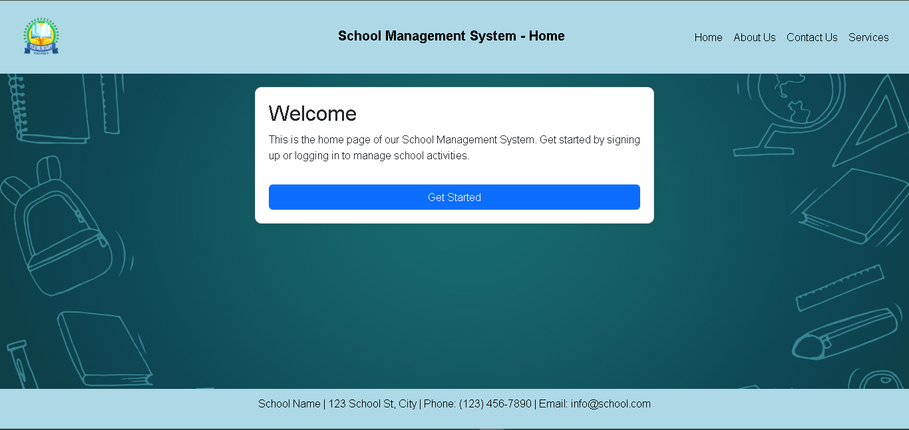
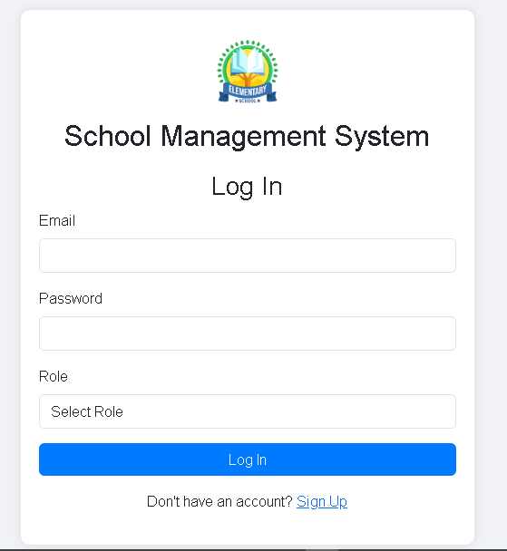
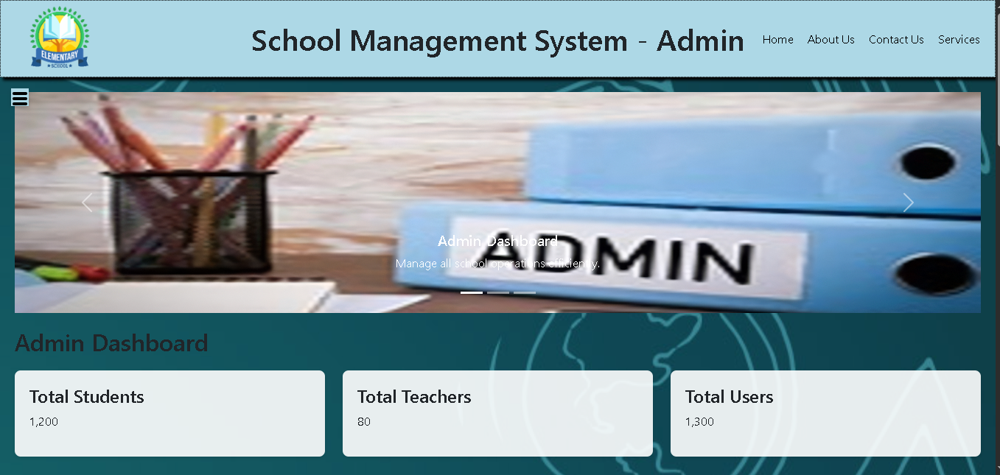
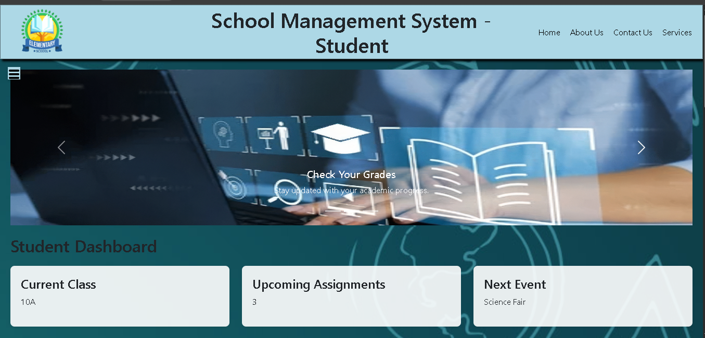
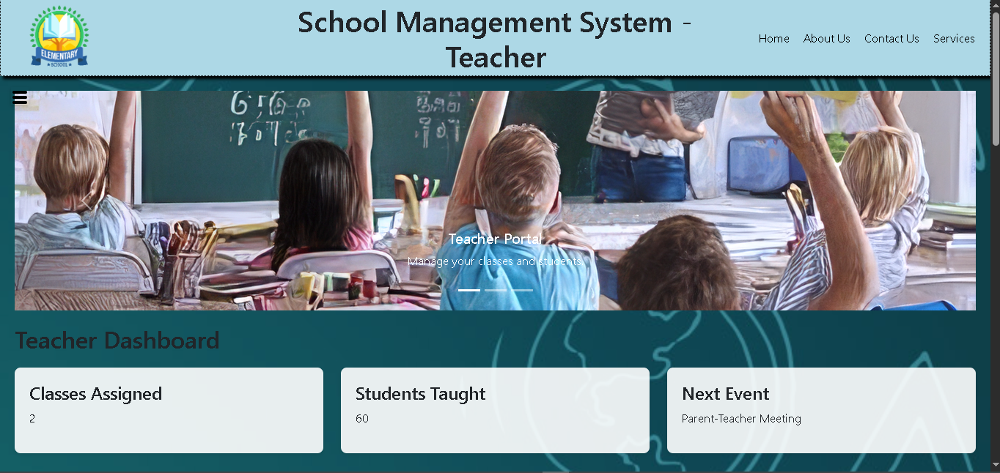

## 📸 Project Screenshots

### Home-page



---

### Login Page



---

### Admin Dashboard



---

### Student Dashboard



---

### Teacher Dashboard




# 🎓 School Management System

A responsive **School Management System Frontend** developed as an academic team project using **HTML, CSS, Bootstrap 5, and JavaScript**.

> **Role:** Project Lead (Team of 3)  
> I led the project development, designed the user interface, coordinated the implementation, and completed the majority of the frontend development.

---

## 📖 Overview

The School Management System is a frontend web application designed to demonstrate the interface of a modern school management platform. It includes separate dashboards and pages for administrators, teachers, and students.

This project was developed as part of the BS Computer Science curriculum at **Federal Urdu University of Arts, Science and Technology (Islamabad Campus).**

---

## ✨ Features

- Responsive user interface
- Modern dashboard design
- Student Dashboard
- Teacher Dashboard
- Admin Dashboard
- Login Page
- About Page
- Contact Page
- School management pages
- Bootstrap-based responsive layout
- User-friendly navigation

---

## 🛠 Technologies Used

- HTML5
- CSS3
- Bootstrap 5
- JavaScript

---

## 📂 Project Structure

```text
School-Management-System/
│
├── fonts/
├── lib/
│   └── bootstrap-5.3.5-dist/
├── screenshots/
├── README.md
├── index.html
├── login.html
├── admin-dashboard.html
├── student-dashboard.html
├── teacher-dashboard.html
└── ...
```

---

## 📸 Project Screenshots

### Home-page


---

### Login Page


---

### Admin Dashboard


---

### Student Dashboard


---

### Teacher Dashboard


---

## 🚀 How to Run

1. Download or clone the repository.
2. Open the project folder.
3. Launch `index.html` in your web browser.

No installation is required.

---

## 📌 Future Improvements

- Backend integration using PHP
- MySQL database
- User Authentication
- Attendance Management
- Fee Management
- Student Records Management
- Result Management
- Responsive enhancements

---

## 👨‍💻 Author

**Muhammad Asad Anwar**

BS Computer Science Student

Federal Urdu University of Arts, Science and Technology

GitHub:
https://github.com/asad-anwar6

---

## 📄 License

This project is developed for educational and learning purposes.